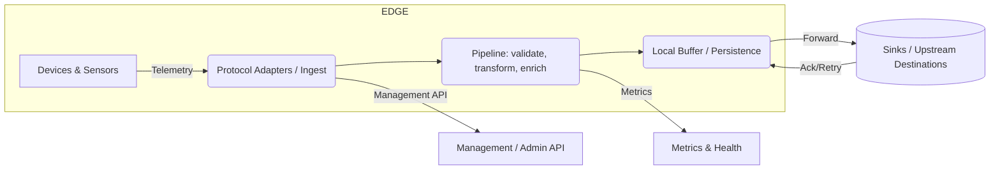

# Industrial Edge Telemetry Gateway

A lightweight, extensible gateway that collects, normalizes, and forwards telemetry from industrial edge devices to cloud or on-prem destinations. Designed for reliability, low-latency processing, and easy deployment (Docker-first).

Badges: (add CI, docker build, license badges here)

- Language: Python (primary)
- Secondary: Shell, Dockerfile

Table of contents
- [Overview](#overview)
- [Key features](#key-features)
- [Repository structure](#repository-structure)
- [Architecture & data flow](#architecture--data-flow)
  - [High-level flowchart (Mermaid)](#high-level-flowchart-mermaid)
  - [Component diagram (Mermaid)](#component-diagram-mermaid)
- [Quickstart (Docker)](#quickstart-docker)
- [Configuration](#configuration)
- [Usage](#usage)
  - [REST API examples](#rest-api-examples)
  - [CLI examples](#cli-examples)
- [Logging & monitoring](#logging--monitoring)
- [Security considerations](#security-considerations)
- [Development setup](#development-setup)
- [Testing](#testing)
- [Contributing](#contributing)
- [License & contact](#license--contact)

Overview
--------
The Industrial Edge Telemetry Gateway accepts telemetry (metrics, events, traces) from industrial devices and local edge systems, performs lightweight processing (validation, transformation, batching), optionally persists to a local store (for offline resilience), and forwards normalized events to one or more upstream destinations (cloud IoT services, message brokers, time-series DBs).

Typical use-cases:
- Collecting telemetry from PLCs, RTUs, OPC-UA servers, Modbus devices.
- Local aggregation to minimize cloud egress and reduce cost.
- Edge pre-processing and enrichment (unit conversion, tagging).
- Buffered, reliable delivery to cloud endpoints.

Key features
------------
- Protocol adapters / connectors (HTTP, MQTT, OPC-UA, Modbus — adapters pluggable)
- Normalization pipeline (validators, enrichers, transformers)
- Local buffering with configurable persistence for intermittent connectivity
- Pluggable output sinks: MQTT, AMQP, HTTP (REST), file, time-series DB
- Docker-ready; can be deployed standalone, in k8s, or via compose
- Metrics and logs for observability
- Auth & TLS support for secure transport

Repository structure
--------------------
Example top-level layout (adjust if actual layout differs):

- bin/                       — helper scripts and CLI wrappers
- Dockerfile                 — image build
- docker-compose.yml         — local compose example
- requirements.txt           — Python dependencies
- src/
  - gateway/                 — main application package
    - adapters/              — protocol adapters (mqtt, http, opcua, modbus)
    - pipeline/              — validation, transformation, enrichment stages
    - sinks/                 — output sinks (cloud, file, db)
    - storage/               — local buffering/persistence
    - api/                   — REST/management API
    - config.py              — configuration loader
    - main.py                — application entrypoint
- tests/                     — unit and integration tests
- scripts/                   — dev / deployment scripts
- README.md

Architecture & data flow
------------------------
This section provides conceptual diagrams illustrating how telemetry flows through the gateway and how components interact.

High-level flowchart (Mermaid)
-----------------------------
Below is a high-level data flow showing ingestion, processing, local buffering, and forwarding. (Render with a Mermaid-capable viewer.)



Component diagram (Mermaid)
---------------------------
Shows components and their roles.

```mermaid
flowchart TB
  Devices --> Adapters[Adapters: HTTP / MQTT / OPC-UA / Modbus]
  Adapters --> Pipeline[Pipeline: validators / enrichers / transformers]
  Pipeline --> Buffer[Local Buffer / DB (sqlite/leveldb)]
  Buffer --> Dispatcher[Dispatcher]
  Dispatcher -->|To Cloud| Sinks[MQTT Broker / HTTP Endpoint / TSDB]
  Dispatcher -->|To File| FileSink[File/Archive]
  subgraph Observability
    Pipeline --> Metrics[Prometheus metrics]
    Logs[Log output] --> Monitoring[Logging backend]
  end
  API[Management API] --> Adapters
  API --> Pipeline
```

Data flow description
- Ingest: adapters accept telemetry in various protocols. Each adapter translates protocol-specific payloads into the gateway's internal event model.
- Pipeline: events pass through a configurable pipeline — validation, enrichment (e.g., adding device metadata), transformation (unit conversion), and routing decisions.
- Buffer: events are buffered locally (in-memory + durable backing) to survive upstream outages, with configurable retention and backpressure handling.
- Dispatcher / Sink: events are batched and delivered to configured sinks with retry/backoff logic. Delivery can be at-least-once; deduplication optional.
- Management API: exposes health, metrics, config reload, and manual replay/flush operations.

Quickstart (Docker)
-------------------
1. Build the image:
```bash
docker build -t industrial-edge-telemetry-gateway:latest .
```

2. Run with docker:
```bash
docker run -d \
  --name edge-gateway \
  -p 8080:8080 \          # management API
  -p 1883:1883 \          # optionally expose MQTT if adapter needs it
  -e GATEWAY_CONFIG=/etc/gateway/config.yml \
  -v /var/lib/edge-gateway:/data \
  industrial-edge-telemetry-gateway:latest
```

3. Or use docker-compose (example snippet below):

```yaml
version: "3.8"
services:
  gateway:
    image: industrial-edge-telemetry-gateway:latest
    ports:
      - "8080:8080"
      - "1883:1883"
    environment:
      - CONFIG_PATH=/etc/gateway/config.yml
    volumes:
      - ./config:/etc/gateway
      - ./data:/data
    restart: unless-stopped
```

Configuration
-------------
Configuration is file-based (YAML/JSON) and/or environment variables. Example minimal config (config.yml):

```yaml
server:
  host: 0.0.0.0
  port: 8080

adapters:
  mqtt:
    enabled: true
    listen_port: 1883
  http:
    enabled: true
    listen_port: 8081

pipeline:
  validators:
    - schema: device_telemetry_v1
  enrichers:
    - add_device_metadata
  transformers:
    - convert_units

storage:
  type: sqlite
  path: /data/buffer.db
  max_items: 10000

sinks:
  - type: http
    name: cloud_ingest
    endpoint: "https://cloud.example.com/ingest"
    batch_size: 100
    retries: 5
    timeout_ms: 10000
```

Environment variables (recommended)
- GATEWAY_CONFIG — path to configuration file
- LOG_LEVEL — debug / info / warn / error
- STORAGE_PATH — override storage path
- METRICS_PORT — port to serve Prometheus metrics

Usage
-----
Management API
- GET /health — health check
- GET /metrics — Prometheus metrics
- POST /config/reload — reload configuration
- GET /buffers — view buffer status
- POST /buffers/flush — force-forward buffered events

REST API examples
- Health:
```bash
curl http://localhost:8080/health
```
- Reload config:
```bash
curl -X POST http://localhost:8080/config/reload
```

CLI examples
- Start gateway in foreground:
```bash
python -m gateway.main --config ./config/config.yml
```
- Run tests:
```bash
pytest -q
```

Logging & monitoring
--------------------
- Logs: structured JSON logs by default. Configure LOG_LEVEL and an external logging endpoint if needed.
- Metrics: Prometheus exporter available at /metrics. Monitor:
  - ingestion rate
  - pipeline latency
  - buffer size and retention
  - sink success/failure rates
- Alerts:
  - buffer size near capacity
  - continuous sink failures
  - high pipeline error rate

Security considerations
-----------------------
- TLS: enable TLS termination for exposed endpoints (MQTT over TLS / HTTPS).
- Authentication: enable adapter-level auth where possible (MQTT username/password, client certificates).
- Secrets: store credentials in a secure store (Vault, k8s secrets) and avoid committing them to git.
- Network: run behind an edge firewall or within a secure edge network zone.
- Update policy: apply regular security updates to base images and Python dependencies.

Development setup
-----------------
1. Create virtualenv and install deps:
```bash
python -m venv .venv
source .venv/bin/activate
pip install -r requirements.txt
```

2. Run unit tests and linting:
```bash
pytest
flake8 src
```

3. Run locally:
```bash
python -m src.gateway.main --config ./config/config.yml
```

Testing
-------
- Unit tests: located under tests/unit
- Integration tests: tests/integration (these may require docker-compose to run upstream mocks)
- Recommended CI: run lint, unit tests, build Docker image, run selected integration smoke tests.

Contributing
------------
Contributions are welcome. Suggested workflow:
1. Fork repo, create a branch feature/issue-123
2. Add tests for new features/bug fixes
3. Open a PR describing changes and include any migration steps
4. Maintain consistent code style and add/update docs

Commit message convention (recommended):
- feat(): new feature
- fix(): bug fix
- docs(): documentation changes
- chore(): tooling or build changes

License & contact
-----------------
- License: (insert license name — e.g., MIT) — add LICENSE file
- Maintainer: mickey-roggers
- Contact / Issues: Open an issue in this repository for bugs and feature requests.

Appendix — common deployment patterns
------------------------------------
1. K8s deployment: Deploy the gateway as a Deployment + Service, use PersistentVolume for buffer storage, and configure horizontal pod autoscaling based on CPU or custom metrics like queue depth.

2. Edge HA pattern: Run two replicas with shared or replicated storage; use sticky routing for device connections.

3. Offline-first: Configure local retention policy and scheduled retries to empty buffer when connectivity is available.

Notes and next steps
--------------------
- Tailor example adapter and sink configs to match the actual supported protocols and cloud provider endpoints in your code.
- If you want, I can:
  - commit this README to the repository,
  - generate a diagram image (PNG/SVG) from the Mermaid diagrams and add it to the repo,
  - or extract accurate details (adapter names, API routes, actual file tree) by inspecting the repository and updating the README to match the code.
Please tell me which of these you'd like me to do next.
